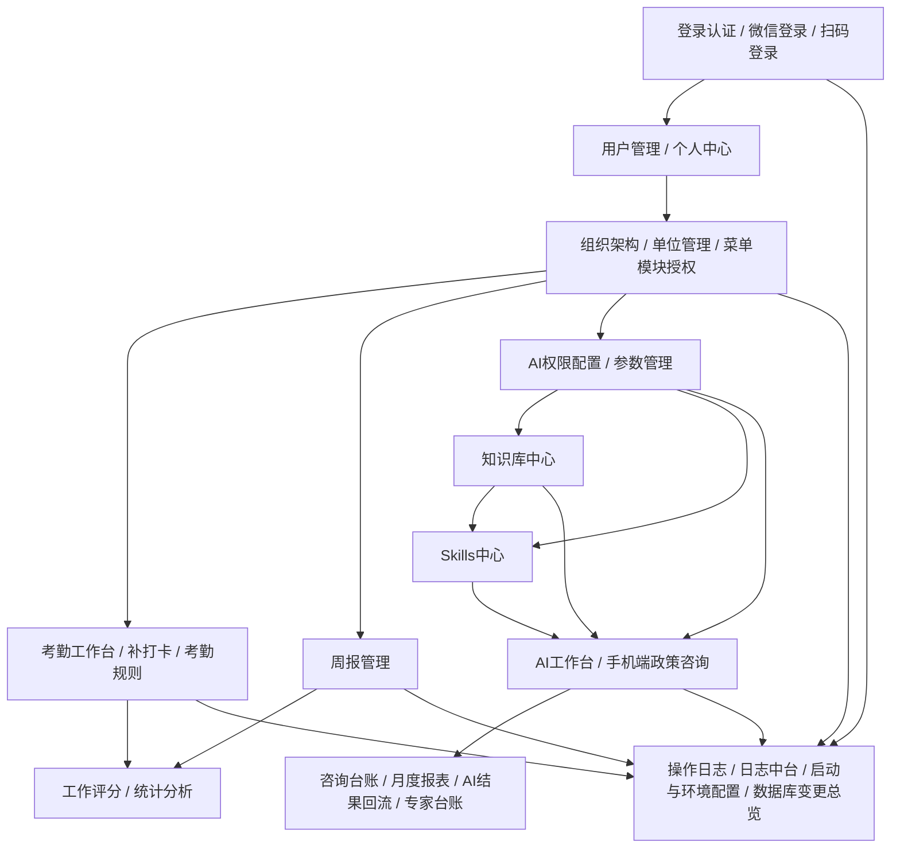
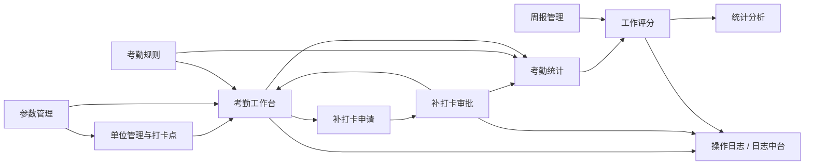
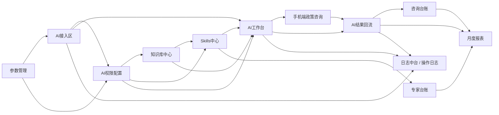
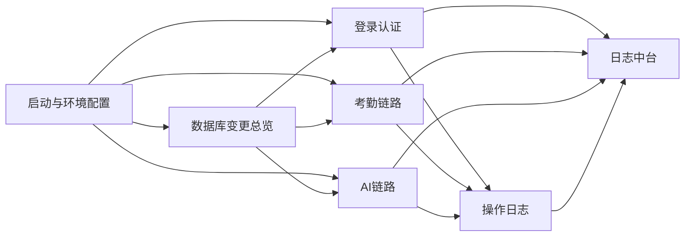

# 项目结构与功能地图

## 1. 业务视角总览

当前系统不是单一业务页，而是一套围绕“账号身份、组织权限、考勤周报、AI 能力、日志运维”展开的综合业务系统。

从业务视角看，当前更适合拆成 5 个一级模块：

1. 认证与账号
2. 组织与权限
3. 考勤与周报
4. AI 模块
5. 日志与运维

## 2. 一级模块说明

### 2.1 认证与账号

核心功能：
- 登录认证
- 微信登录与扫码登录
- 用户管理
- 个人中心与强制改密

主要作用：
- 提供统一登录入口与当前用户身份上下文
- 为菜单权限、数据权限、AI 权限提供账号基础

### 2.2 组织与权限

核心功能：
- 组织架构
- 单位管理与打卡点
- 菜单模块授权
- AI 权限配置
- 参数管理

主要作用：
- 定义用户层级、单位归属、菜单范围、AI 使用范围和关键系统参数
- 是大部分业务模块的前置控制层

### 2.3 考勤与周报

核心功能：
- 考勤工作台
- 补打卡申请
- 补打卡审批
- 考勤规则
- 考勤统计
- 周报管理
- 工作评分
- 统计分析

主要作用：
- 形成从签到、异常、审批、规则到评分、统计的完整业务闭环

### 2.4 AI 模块

核心功能：
- AI接入区
- AI权限配置
- 知识库中心
- Skills中心
- AI工作台
- 手机端政策咨询
- 咨询台账
- 月度报表
- 专家台账
- AI结果回流

主要作用：
- 形成从模型接入、权限开通、知识与技能配置，到问答、留痕、报表和回流的完整 AI 能力链

### 2.5 日志与运维

核心功能：
- 日志中台
- 操作日志
- 启动与环境配置
- 数据库变更总览

主要作用：
- 提供审计、排障、环境统一和数据库变更治理能力

## 3. 系统主关系图

## 4. 考勤全链路关系图

当前闭环判断：
- `单位管理与打卡点 -> 考勤工作台 -> 补打卡申请 -> 补打卡审批 -> 考勤统计 -> 工作评分 -> 统计分析` 已形成较清晰主链
- 仍然存在的断点主要是：
  - 补卡审批通过后对统计、评分的刷新时点说明不够集中
  - 规则变更后是否重算历史数据尚未形成统一专题
  - 考勤统计与统计分析名称相近，但数据来源不同，容易混淆

## 5. AI 全链路关系图

当前闭环判断：
- `AI接入区 -> AI权限配置 -> 知识库中心 -> Skills中心 -> AI工作台 -> 手机端政策咨询 -> AI结果回流 -> 咨询台账 -> 月度报表` 已形成较清晰主链
- 仍然存在的断点主要是：
  - `AI结果回流` 没有独立页面，逻辑分散在服务层和台账/月报页
  - 手机端真实微信环境、后台台账和月报之间的正式验收记录不足
  - AI 权限、知识库权限、技能权限三层配置的冲突诊断仍待补充

## 6. 日志与运维关系图

## 7. 权限、参数、AI、日志之间的联动说明

### 7.1 权限与考勤

- 菜单模块授权决定用户能否看到考勤统计、补卡审批、工作评分等入口
- 组织架构和单位归属决定考勤数据、补卡审批和统计范围

### 7.2 权限与 AI

- 菜单模块授权决定用户能否看到 `AI接入区 / AI权限配置 / AI工作台 / 咨询台账 / 月度报表 / 专家台账 / 手机端政策咨询`
- AI 权限配置决定看得到入口后能否真正使用 AI、知识库和技能能力

### 7.3 参数与考勤

- 参数管理会影响打卡半径、默认口径等运行参数
- 参数错误会沿着 `单位管理与打卡点 -> 考勤工作台 -> 统计` 链路扩散

### 7.4 参数与 AI

- 参数管理承接系统级运行口径，例如当前工作知识库等
- 参数异常会沿着 `知识库中心 / AI工作台 / 月度报表` 链路扩散

### 7.5 日志与排障

- 操作日志更偏“谁做了什么”
- 日志中台更偏“系统发生了什么异常、请求与诊断”
- 启动与环境配置、数据库变更总览是排查“为什么今天和昨天表现不一样”的源头资料

## 8. 当前主要页面入口

基于路由与模块常量，当前主要业务入口包括：

- `/login`
- `/mobile-workspace`
- `/policy-consultant`
- `/users`
- `/profile`
- `/org-tree`
- `/units`
- `/params`
- `/attendance`
- `/attendance/stats`
- `/attendance/patch-apply`
- `/attendance/patch-approvals`
- `/attendance/rules`
- `/weekly-work`
- `/scores`
- `/statistics`
- `/knowledge`
- `/skills`
- `/ai-workbench`
- `/ai-ledger`
- `/ai-monthly-report`
- `/experts`
- `/ai-provider`
- `/ai-permissions`
- `/operation-logs`
- `/log-center`

来源：
- `frontend/src/router/index.js`
- `frontend/src/constants/modules.js`
- `frontend/src/constants/mobile-workspace.js`
- `frontend/src/config/pageHelp.js`

## 9. 当前治理结论

当前代码层已经具备明显的模块化结构，但文档层在本轮治理之前仍缺少“一个功能一个正式主文件 + 一个总索引 + 一层问题与回归层”的固定入口。

后续建议固定如下原则：

1. 正式主记忆只放在 `docs/开发记忆/`
2. 一个功能一份主文件
3. 总索引统一跳转
4. 问题修复与功能说明分层治理
5. 不再把主记忆继续散落到 `progress.md / tasks.md / 临时 txt / 零散 md`
